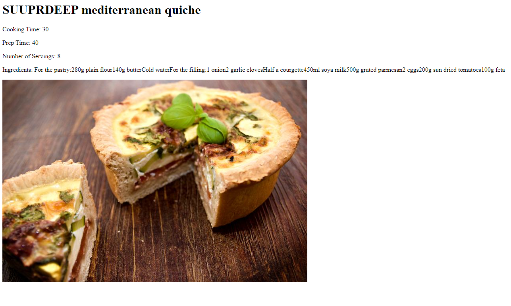

## CSC 496 Spring 2024 Gatsby Site - Camden Stamm

This repo consists of a Gatsby.js project for our Senior Seminar Computer Science course. I built this website with Gatsby.js and make use of React components throughout the site.

The Blog page consists of a series of .mdx blog posts. This page utilizes a GraphQL query to pull data from the blog file and output the date, title, and slug of each blog post. The links to each post are created based on the data from the query, so anytime a new post is added it will make the link and associated data for it without the need to edit the blog page.

The Recipe and Article pages contain a set of links to pages that were created programmatically using data that was pulled from a Drupal demo site. I used the gatsby-source-graphql plugin to query the site using GraphQL in the gatsby-node file. I then used template files, one for the articles and one for the recipes, as templates to programmatically generate pages based on the query data that was received. In this case I wrote the query to take the first 10 articles and recipes, so 10 pages of each are created (assuming there are enough.) 

(Here's an example of one of the recipe pages that was created)

## 🚀 Deploying with GitHub Actions

Before using GitHub Actions, the process of deploying my Gatsby project to our class webserver included running gatsby build in the directory of the project, then running a command like rsync to upload the public folder to the server once the local system is verified through ssh. This is a quite a bit more tedious than having GitHub do it for you automatically everytime you push your changes. So, I set up a GitHub Actions workflow in order to automate this process. Everytime a push is made to the repository, the workflow first checks out the repo files and sets up Node.js on the GitHub runner. That is necessary to install npm and the gatsby command line interface so that gatsby build can run using the repo. Then, to connect to the server, ssh connection is set up between the runner and the server and an sftp command is ran to finally upload the public file. Once this is complete, the changes are reflected on the server!
